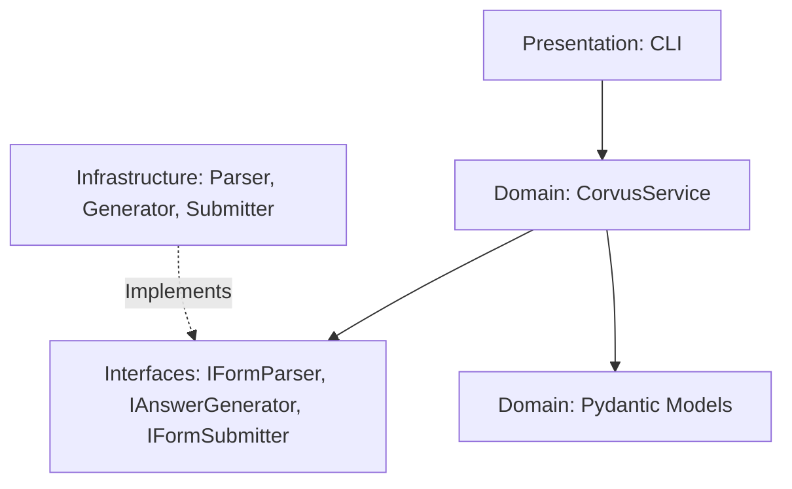

<div align="center">

# Corvus

**Corvus, is an automated, AI-driven survey answering tool designed to programmatically fetch, parse, and submit Google Forms from the perspective of user-defined personas.**

The system uses Large Language Models (LLMs) via OpenAI's structured outputs to evaluate form fields (including complex multiple-choice, scales, and grids), generate realistic and consistent answers aligned with a psychological profile, and submit them directly via high-performance HTTP requests.

[](https://www.python.org/downloads/)
[](LICENSE)

</div>

---

## Features

- **Dynamic Form Parsing:** Fetches raw Google Forms HTML and extracts form configurations, action URLs, scale descriptors, and CSRF tokens (`fbzx`) directly from Google's internal JSON variable (`FB_PUBLIC_LOAD_DATA_`).
- **High Performance HTTP Submission:** Emulates the multi-page advancement machinery (session handling and `pageHistory` tracking) purely through raw HTTP `POST` requests—avoiding heavy and slow browser automation drivers like Playwright or Selenium.
- **Agentic Decision-Making:** Leverages OpenAI API-compatible LLM providers to synthesize rich character/demographic profiles into consistent, context-aware answers.
- **Robust Option Matching:** Normalizes character casing, spacing, and Turkish language character variations to confidently match the AI's response to the form's exact choice constraints.
- **Clean Architecture & SOLID:** Engineered with strict separation of layers (Domain, Interface Ports, Infrastructure, and Presentation) allowing easy extension of LLMs, HTTP clients, or form formats.

---

## Project Architecture

The codebase strictly follows **Clean Architecture** patterns to enforce testability and separation of concerns:



- **`src/domain/`**: Contains core enterprise business entities (Pydantic models like `GoogleForm`, `FormField`, `Persona`, `FormAnswers`) and the orchestrating `CorvusService` (pure logic, zero external dependencies).
- **`src/interfaces/`**: Holds high-level port declarations (`ports.py` abstract base classes) that isolate business rules from underlying implementations.
- **`src/infrastructure/`**: Houses concrete low-level implementations like scraping (`GoogleFormParser` using BeautifulSoup), LLM generation (`OpenAIAnswerGenerator` via the official `openai` SDK), and HTTP posting (`HttpFormSubmitter` using `requests`).
- **`src/presentation/`**: Consists of the user-facing command-line entrypoint (`cli.py`).

---

## Setup & Installation

### 1. Prerequisites
- **Python >= 3.12**
- **[uv]**(https://github.com/astral-sh/uv) (An extremely fast Python package and project manager).

### 2. Installation
Clone this repository and sync the dependencies:

```bash
# Clone the repository
git clone https://github.com/celikfatih/corvus.git
cd corvus

# Automatically create a virtual environment and install dependencies
uv sync
```

---

## Configuration

1. Copy the environment variables template file:
```bash
cp .env.example .env
```

2. Open the newly created `.env` file and configure it with your active API key and target URL:

```ini
# Base URL for the OpenAI-compatible API endpoint (NVIDIA NIM, DeepSeek, etc.)
AI_API_URL=https://integrate.api.nvidia.com/v1

# Your API secret token
AI_API_TOKEN=your-token-here

# The model identifier to use (e.g. meta/llama-3.1-70b-instruct)
AI_API_MODEL=meta/llama-3.1-70b-instruct

# Sequential chunk size for long form surveys
AI_CHUNK_SIZE=30

# Path to the active participant persona file (relative path)
PERSONA_FILE=persona/persona-example.md

# Target Google Form URL to parse & answer
FORM_URL=https://docs.google.com/forms/d/.../viewform
```

---

## Creating Personas

Personas are written as Markdown documents that detail the general demographics, psychological profile, and decision-making criteria of the artificial participant.

An example is provided at `persona/persona-example.md`. All other markdown files you place in the `persona/` directory are automatically ignored by Git to keep your development workspace clean:

```markdown
# Participant Persona: "Alex"
### General Demographics
* **Name:** Alex
* **Gender:** Non-binary
* **Age:** 23
* **Education:** Senior Computer Science student at a technical university.

### Psychological & Behavioral Profile
- **Future Career Outlook:** Optimistic but realistic, values work-life balance and sustainability.
- **Career Adaptability:** High resilience, always has a solid B-plan.
```

---

## Running the Agent

To execute the agent using `uv` (which handles loading the virtual environment automatically):

```bash
uv run src/presentation/cli.py
```

The terminal will print detailed real-time logs tracking:
1. Loading the persona file.
2. Fetching and parsing the form structure.
3. Batching and submitting prompt chunks to the AI model.
4. Sending form answers to the Google Form endpoints.
5. Saving a structured log of successful submissions to `submission_history.log`.

---

## Testing

To run automated unit tests verifying the parsing and option matching heuristics, run:

```bash
uv run pytest
```

---

## License

This project is licensed under the **MIT License** (stored in the remote repository root). Feel free to use, modify, and distribute it as you see fit!
